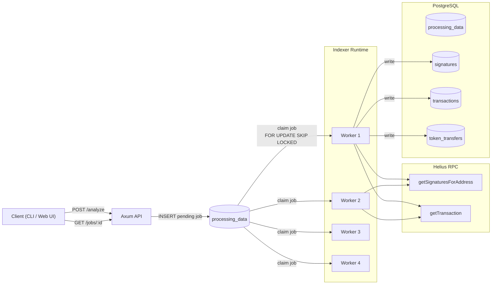

# On-Chain Event Indexer

> **[ARCHIVED] — EDUCATIONAL PURPOSE ONLY**
>
> This project is frozen. It was used as a training ground for learning Rust, the Tokio async runtime, and interaction with Solana RPC. **Not intended for production use.**

---

## Stack

**Rust** · **Tokio** · **PostgreSQL (sqlx)** · **Helius RPC API** · **Axum** · **Governor**

---

## Original Architecture

### Pipeline

1. **Axum API** accepts `POST /analyze` with a wallet address and creates a job in `processing_data`.
2. **Worker pool** (`tokio::spawn`, 4 workers) atomically claims jobs in a loop via `FOR UPDATE SKIP LOCKED`.
3. **Paginated signature collection** — calls `getSignaturesForAddress` in pages of 1000, filters by time window (`requested_hours`), writes to the `signatures` table.
4. **Batched transaction fetching** — unprocessed signatures are read from the DB in batches of 100; `getTransaction` is called in chunks of 10 with `jsonParsed` encoding.
5. **Token transfer extraction** — `transfer`, `transferChecked`, `mintTo`, `burn` are extracted from `parsed` instructions for SPL tokens and native SOL transfers. Results are normalized into a single `TokenTransferChange` struct and written to `token_transfers`.
6. **Status update** — after all signatures are processed, the job transitions to `ready` (with a guard check ensuring no unprocessed signatures remain).

### RPC Load Control

- `governor` — RPS limiting.
- `Semaphore` — concurrent HTTP request limiting.
- Shared cooldown — shared state across all workers after a rate-limit event.
- Exponential backoff with equal-jitter — for retries on `429` / RPC rate-limit errors.

### Implemented Patterns

- **Hexagonal Architecture (attempt):** The `Database` layer acts as a facade, delegating calls to internal modules `Jobs`, `Signatures`, `Transactions`, each owning its own `PgPool`. Business logic in `indexer.rs` operates solely through the public interface of `Database` and `HeliusApi`, without knowledge of storage details.
- **Type-Driven Design (attempt):** `ClaimedJob`, `SaveStats`, `JobInfo`, `TransactionResult`, `TokenTransferChange` — domain types with newtype semantics instead of raw tuples. `ResponseField<T>` — a custom enum to distinguish `Missing` / `Null` / `Value` in RPC responses instead of `Option<Option<T>>`.

---

## Diagram

---

## Engineering Post-Mortem

An honest breakdown of why this architecture would not survive in a real Web3 environment.

### 1. DB Bottleneck: PostgreSQL as a Job Queue

`FOR UPDATE SKIP LOCKED` on `processing_data` is a workable primitive for a queue handling dozens of jobs, but a **fatal mistake** for a system that aims for Solana-level throughput.

- Every `claim` is a row `UPDATE` that generates a dead tuple. With millions of transactions and frequent status transitions (`pending → indexing → ready/error`), the table will bloat with dead rows.
- `VACUUM` cannot keep up if write throughput is consistently high — a classic PostgreSQL MVCC trap.
- The proper approach: a dedicated message broker (RabbitMQ, NATS, Redis Streams), or at minimum `LISTEN/NOTIFY` + a separate log table instead of in-place status `UPDATE`s.

### 2. Normalization Mistake: 4 Tables Without Partitioning

The schema is split into `processing_data`, `signatures`, `transactions`, `token_transfers` — this looks reasonable at the prototype stage but breaks at real-world volumes:

- `signatures` is not partitioned. Indexing even a single popular address (DEX, marketplace) easily grows the table to tens of millions of rows. The partial index `WHERE is_processed = FALSE` helps with reads but does not prevent bloat from mass `UPDATE is_processed = TRUE` operations.
- `token_transfers` stores all events without partitioning by `block_time` or `tracked_owner`. Heavy analytical `JOIN`s between `transactions` and `token_transfers` at millions of rows means full scans or index bloat.
- No `FOREIGN KEY`s in migrations — intentional, but it means data consistency relies entirely on application code. A bug in code = silent data corruption.

### 3. Parsing Illusion: Manual `getTransaction` Parsing

The parser extracts `transfer`, `transferChecked`, `mintTo`, `burn` from `jsonParsed` responses — this covers basic cases, but in practice it's a dead end:

- **Custom programs** (Jupiter, Raydium, Tensor, Meteora, and hundreds more) wrap transfers in their own CPI calls. `jsonParsed` only surfaces instructions from known Solana programs (`system`, `spl-token`); everything else arrives as raw bytes.
- **Transfer direction** (`direction`) is hardcoded as `"unknown"` — proper resolution requires knowing which address is being tracked and comparing `source_owner` / `destination_owner` against it. This was not implemented.
- **Scale of the problem:** Solana has hundreds of DeFi protocols, NFT marketplaces, and lending platforms with unique IDLs. Full parsing requires either an IDL registry + Anchor/native deserialization, or leveraging existing solutions (Helius Enhanced API, Shyft, Yellowstone gRPC).
